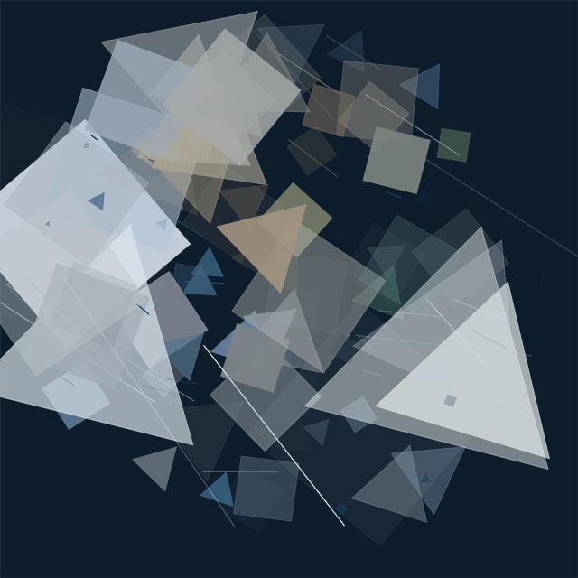

# Generative Art in Go
My take on the work presented in [Generative Art in Go by Preslav Rachev](https://preslav.me/generative-art-in-golang/).

Examples | ~
---------|---
 | 

## Libraries
- [fogleman/gg](https://github.com/fogleman/gg)

## Usage
```
$ gogenart -h
Usage of ./gogenart:
  -fill int
        1 in N chance to fill polygon (default 1)
  -i int
        number of iterations (default 10000)
  -max uint
        maximum number of polygon sides (default 5)
  -min uint
        minimum number of polygon sides (default 3)
  -o string
        file to use as output (default "stdout")
  -s float
        polygon size (percentage of width) (default 0.1)
```

The command can receive input and output in various ways.
```bash
# All of the following are equivalent:
$ cat example.jpeg | gogenart > result.jpeg

$ gogenart example.jpeg > result.jpeg

$ gogenart -o=result.jpeg example.jpeg
```

```bash
# Both JPEG and PNG files can be used.
$ gogenart example.png > result.png
```

# Authors
Adrian Agnic [ [Github](https://github.com/ajagnic) ]
