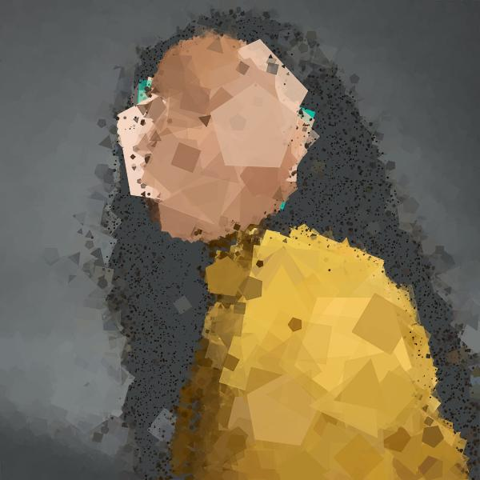
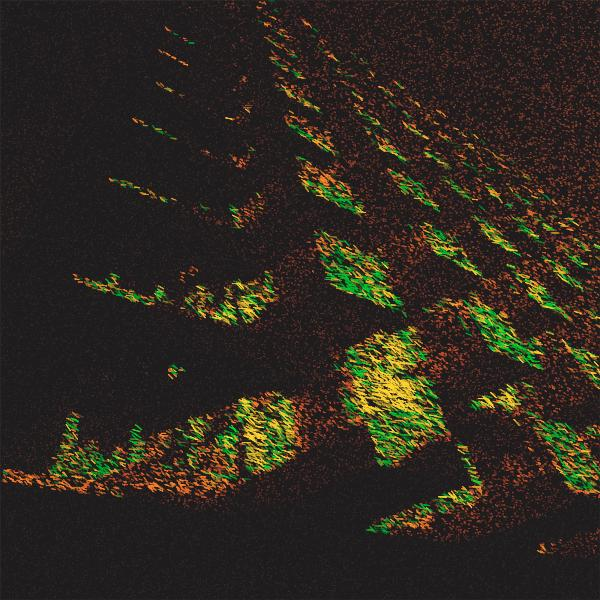

# Generative Art in Go
My take on the work presented in [Generative Art in Go by Preslav Rachev](https://preslav.me/generative-art-in-golang/).

<p align="center" width="100%">



</p>

## Libraries
- [fogleman/gg](https://github.com/fogleman/gg)

## Usage
```
Usage of ./gogenart:
  -color int
        1 in N chance to randomize polygon color
  -fill int
        1 in N chance to fill polygon (default 1)
  -height uint
        desired height of image
  -i int
        number of iterations (default 10000)
  -max uint
        maximum number of polygon sides (default 5)
  -min uint
        minimum number of polygon sides (default 3)
  -o string
        file to use as output
  -s float
        polygon size (percentage of width) (default 0.1)
  -shake float
        amount to randomize pixel positions
  -width uint
        desired width of image
```

The command can receive input and output in various ways.
```bash
# All of the following are equivalent:
$ cat example.jpeg | gogenart > result.jpeg

$ gogenart example.jpeg > result.jpeg

$ gogenart -o=result.jpeg example.jpeg
```

```bash
# Both JPEG and PNG files can be used.
$ gogenart example.png > result.png

# Extensions can be converted if using the -o flag.
$ gogenart -o=result.png example.jpeg
```

## The Drawing Algorithm
```go
// A random pixel is selected,
// its luminance is used to scale a polygon,
// and the polygon is drawn with the color of that pixel.
rx := rand.Float64() * s.width
ry := rand.Float64() * s.height
...
l := luminance(r, g, b)
stroke := s.stroke * l
...
s.dc.SetRGBA255(r, g, b, rand.Intn(256))
s.dc.DrawRegularPolygon(sides, x, y, stroke, rand.Float64())
...
```

# Authors
Adrian Agnic [ [Github](https://github.com/ajagnic) ]
