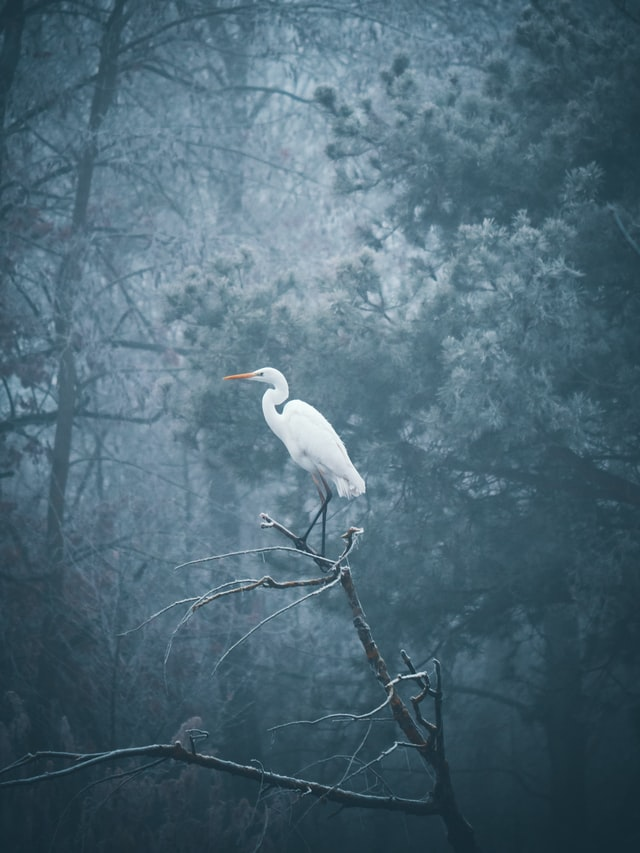
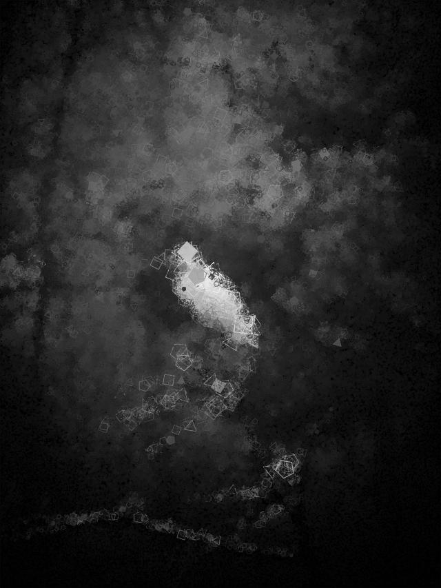
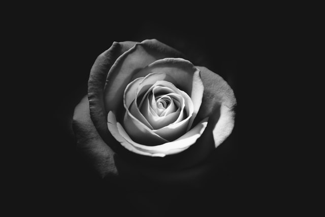
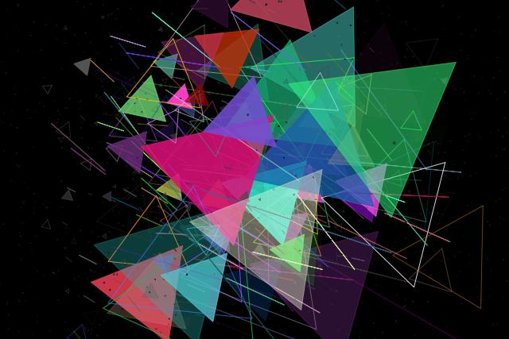

# Generative Art in Go

<p align="center" width="100%">


</p>

My take on the work presented in [preslavrachev/generative-art-in-go](https://github.com/preslavrachev/generative-art-in-go).
This project differs from Preslav's by a couple of things:
- *gogenart* is firstly structured as a command line tool, although the _sketch_ package can be imported
- The drawing algorithm implements pixel luminance as a scaling factor. This essentially uses the origin image as a 'heatmap' of sorts, in which larger polygons will be drawn where pixels are brighter
- Additonal features:
  - random color and fill
  - random pixel rotation
  - greyscale, using luminance

## Libraries
- [fogleman/gg](https://github.com/fogleman/gg)

## Usage
```
Usage of ./gogenart:
  -color uint
        percent chance to randomize polygon color
  -fill uint
        percent chance to fill polygon (default 100)
  -grey
        convert to greyscale
  -height uint
        desired height of image
  -i int
        number of iterations (default 10000)
  -invert
        invert luminance scaling
  -max uint
        maximum number of polygon sides (default 5)
  -min uint
        minimum number of polygon sides (default 3)
  -o string
        file to use as output
  -s float
        polygon size (percentage of width) (default 0.1)
  -shake float
        amount to randomize pixel positions
  -spin uint
        max degrees to rotate pixel positions
  -width uint
        desired width of image
```

```bash
# All of the following are equivalent:
$ cat example.jpeg | gogenart > result.jpeg

$ gogenart example.jpeg > result.jpeg

$ gogenart -o=result.jpeg example.jpeg
```

```bash
# Both JPEG and PNG files can be used.
$ gogenart example.png > result.png

# Format can be converted if using the -o flag.
$ gogenart -o=result.png example.jpeg
```

## The Drawing Algorithm
```go
// A random pixel is selected,
// its luminance is used to scale a polygon,
// and the polygon is drawn with the color of that pixel.
rx := rand.Float64() * s.width
ry := rand.Float64() * s.height
...
l := luminance(r, g, b)
stroke := s.stroke * l
...
s.dc.SetRGBA255(r, g, b, rand.Intn(256))
s.dc.DrawRegularPolygon(sides, x, y, stroke, rand.Float64())
...
```

## Examples
Depending on the parameters used and their values, one can achieve a wide range of effects.

Here we keep most of the resolution of the original image, due to the high iteration and small polygon size.

<p align="center" width="100%">


</p>

```bash
$ ./gogenart -i=250000 -s=0.03 -fill=10 -shake=0.01 -grey \
-o=examples/crane.jpeg \
examples/crane-original.jpg
```

With low iteration and large polygons, a lot of shake, and completely random color, we can create an entirely original image. 

<p align="center" width="100%">


</p>

```bash
$ ./gogenart -i=2000 -s=0.2 -min=2 -max=3 -shake=0.2 -fill=50 -color=100 \
-o=examples/rose.jpeg \
examples/rose-original.jpg
```

## Using the sketch package
```go
f, _ := os.Open("example.jpeg")

img, enc := sketch.Source(f) // decode image from io.Reader

config := sketch.Params{
      Iterations:         10000,
      PolygonSidesMin:    3,
      PolygonSidesMax:    5,
      PolygonFillChance:  1.0,
      PolygonColorChance: 0.0,
      PolygonSizeRatio:   0.1,
      PixelShake:         0.0,
      PixelSpin:          0,
      NewWidth:           0.0,
      NewHeight:          0.0,
      Greyscale:          false,
      InvertScaling:      false,
}

genart := sketch.NewSketch(img, config).Draw()

out, _ := os.Create("result.jpeg")

sketch.Encode(out, genart, enc) // encode and write to io.Writer
```

# Authors
Adrian Agnic [ [Github](https://github.com/ajagnic) ]
